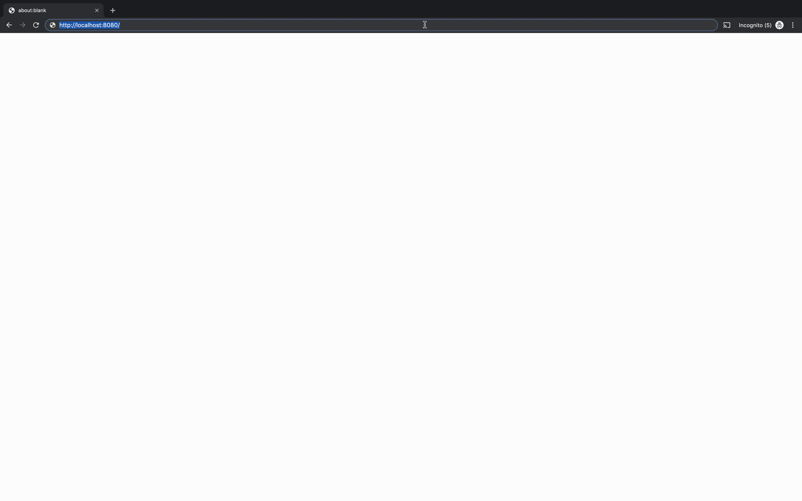
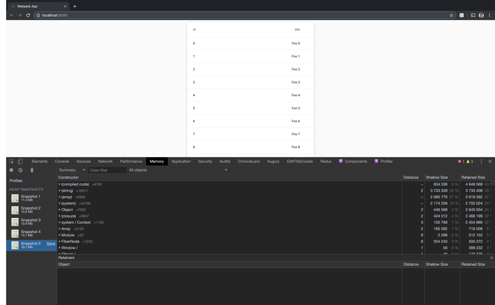

# more-advanced-streams

Suppose you have a REST API that returns an array of 1 million JSON records like so:

```json
{
  "records": [
    {
      "id": "0",
      "foo": "bar"
    },
    ...
    {
      "id": "999999",
      "foo": "bar"
    }
  ]
}
```

You want to start displaying data **before** the full response body is available. How do you do it? With `JSONStream` and `readable-stream`!

To put a reasonable amount of content in the DOM, only the first 100 results are displayed.

## Getting Started

```
npm i
npm start
```

Your browser will automatically open to http://localhost:8080/

Demo Video:



Memory usage remains stable over time:


